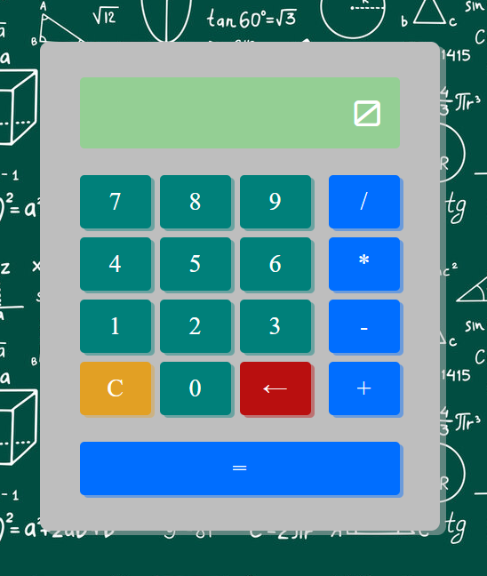
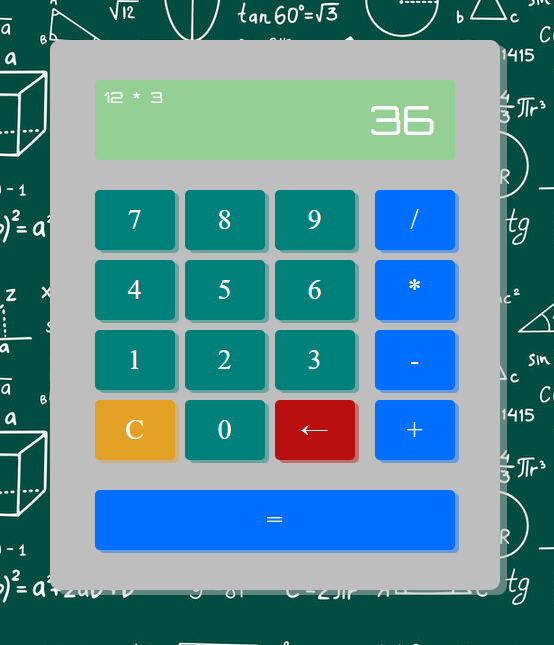

# Calculator

A project done with the objective of training my skills in JavaScript, developing a calculator that does simple math operations such as addition, subtraction, division and multiplication. The main ideia is to use JS objects to make these operations to get the expected results. It's responsive and works with both mouse clicking and keyboard typing. 

Projeto feito com intuito principal de treinar minhas habilidades em JavaScript, desenvolvendo uma calculadora que faz contas simples de soma, subtração, divisão e multiplicação. A ideia principal é fazer utilizando objetos JS para realizar as operações e atingir o resultado esperado. É responsivo e funciona tanto clicando com o mouse quanto digitando no teclado.

## Screenshots

## Challenges (Desafios)
The most challenging part of this project was developing the programming logic for how I could get the numbers without using a console. It took me some time, but I decided to use arrays, where I could include and store the numbers that would be used in the operations.

A parte mais desafiadora do projeto foi desenvolver a lógica de programação de como eu pegaria os números sem usar um console. Levou um tempo, mas decidi usar arrays, onde poderia incluir e armazenar os números que seriam utilizados nas operações.

## Learnings (Aprendizados)

* Programming logic skills improved;
* A better understanding of how 'addEventListener' works;
* Increased familiarity with JavaScript.

* Lógica de programação melhorada;
* Maior entendimento de como funciona addEventListener;
* Mais familiaridade com JavaScript.

## Link

Deploy: <https://iurygon.github.io/Calculator/>
